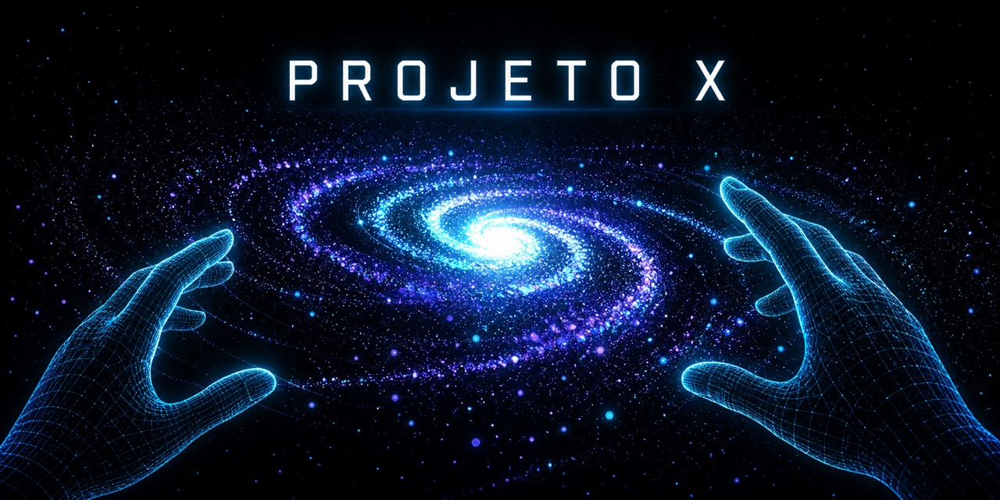
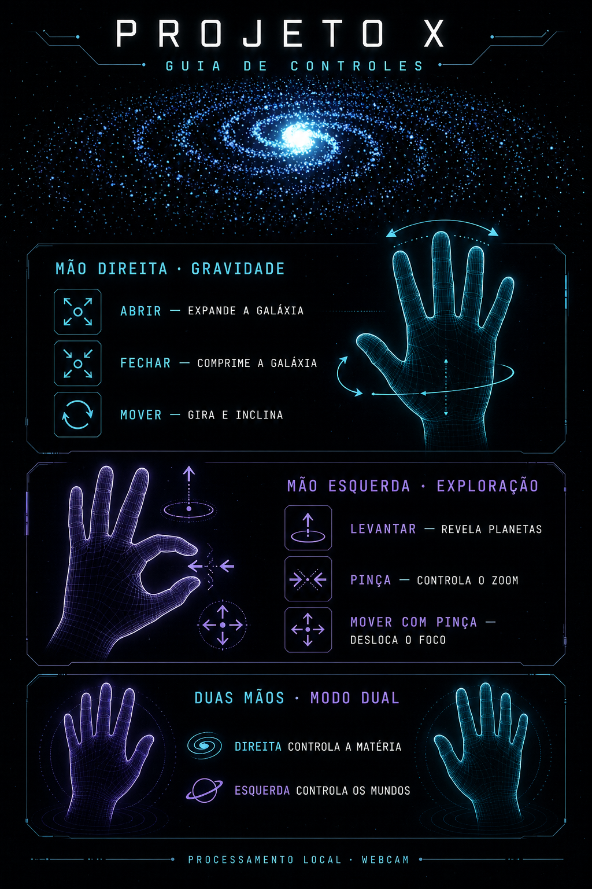

<div align="center">



# Projeto X

**Experiência interativa de visão computacional e arte generativa controlada por gestos.**

[](https://www.typescriptlang.org/)
[](https://threejs.org/)
[](https://ai.google.dev/edge/mediapipe/solutions/guide)
[](https://projeto-x-lime.vercel.app)

Transforme os movimentos das mãos em gravidade, expansão, rotação e exploração de uma galáxia renderizada em tempo real no navegador.

</div>

## Sobre o projeto

O Projeto X transforma as mãos em dois instrumentos complementares. A mão direita controla a matéria da galáxia: aberta expande o campo estelar e fechada atrai cada estrela para o núcleo. A mão esquerda materializa um sol holográfico inspirado em interfaces de ficção científica. Abrir e fechar essa mão restaura, encolhe ou faz o astro desaparecer; a distância entre o polegar e o indicador controla um zoom cinematográfico focado exclusivamente nele. Toda a experiência funciona no navegador, sem backend, banco de dados ou envio das imagens da câmera.

## Tecnologias

- Vite e TypeScript
- Three.js e WebGL
- MediaPipe Tasks Vision (`@mediapipe/tasks-vision`)
- CSS puro
- `THREE.Points`, `BufferGeometry` e shaders GLSL

## Como funciona

```text
Webcam
  ↓
MediaPipe Hand Tracking
  ↓
Hand Landmarks
  ↓
Gesture Analysis
  ↓
Interaction State
  ↓
Three.js
  ↓
Galaxy Particle System
```

O MediaPipe identifica 21 landmarks de até duas mãos e fornece a lateralidade de cada detecção. A função `getHandOpenness(landmarks)` combina três sinais para cada dedo: comprimento direto em relação à cadeia das articulações, alinhamento entre as falanges e distância da ponta do dedo até a palma. Todas as distâncias são normalizadas pelo comprimento e pela largura da própria palma, reduzindo a influência da distância até a webcam.

O resultado é um valor contínuo entre `0` e `1`, filtrado com suavização exponencial dependente do tempo. A pinça esquerda também é normalizada pelo tamanho da palma. Quando uma mão desaparece, somente o canal controlado por ela retorna suavemente ao estado neutro.

## Arquitetura

```text
src/
├── camera/
│   └── CameraPreview.ts       # Janela de câmera e overlay opcional de landmarks
├── config/
│   └── constants.ts           # Modelo, performance e configuração de debug
├── galaxy/
│   ├── Galaxy.ts              # Cena, render loop e deformação GPU
│   ├── SolarWorld.ts          # Sol holográfico, órbitas, raios e partículas
│   └── galaxyGenerator.ts     # Geração procedural dos buffers imutáveis
├── hand/
│   ├── HandTracker.ts         # Webcam e inferência MediaPipe
│   ├── handMath.ts            # Operações geométricas normalizadas
│   ├── handOpenness.ts        # Análise contínua da abertura da mão
│   └── smoothing.ts           # Filtro exponencial independente do FPS
├── interaction/
│   └── InteractionState.ts    # Estado desacoplado entre visão e renderização
├── styles/
│   └── main.css
└── main.ts                    # Orquestração da experiência
```

As posições-base das partículas permanecem no `BufferGeometry`. A compressão, a expansão e o vórtice são calculados no vertex shader a partir de uniforms, sem reescrever milhares de posições a cada frame. Essa divisão mantém o gerador procedural independente do material e facilita novas versões dos shaders.

## Como executar

Requisitos: Node.js 20 ou superior e uma webcam.

```bash
npm install
npm run dev
```

Acesse a URL local exibida pelo Vite, clique em **ATIVAR CÂMERA** e permita o acesso. A primeira inicialização baixa o modelo oficial do MediaPipe; nenhuma chave de API é necessária.

Para validar a versão de produção:

```bash
npm run build
npm run preview
```

> O acesso à webcam exige `localhost` ou uma origem HTTPS em produção.

## Controles

- **Abrir/fechar a mão direita:** expande ou comprime a galáxia.
- **Mover a mão direita:** altera sutilmente a rotação e a inclinação.
- **Levantar a mão esquerda aberta:** materializa o sol holográfico.
- **Fechar a mão esquerda:** encolhe o sol progressivamente até fazê-lo desaparecer.
- **Abrir novamente a mão esquerda:** restaura o sol e toda a sua energia.
- **Fazer pinça com a mão esquerda:** aproxima a câmera progressivamente até um close detalhado e foca apenas o sol.
- **Mover a mão esquerda durante a pinça:** altera sutilmente o enquadramento solar.

Para visualizar os landmarks, altere `DEBUG_HAND_TRACKING` para `true` em `src/config/constants.ts`.

## Próximas funcionalidades

- Calibração opcional por usuário e condições de iluminação.
- MediaPipe em Web Worker com `OffscreenCanvas` quando o suporte for adequado.
- Adaptação dinâmica de qualidade baseada no tempo de frame.
- Novas camadas de plasma procedural e distorção térmica no sol.
- Materiais e pós-processamento WebGL ainda mais sofisticados.

## Prévia e guia de controles

<div align="center">
  
</div>

## Demo

**[Acessar a experiência publicada](https://projeto-x-lime.vercel.app)**

Para iniciar, clique em **ATIVAR CÂMERA** e permita o acesso à webcam. O processamento dos gestos acontece localmente no navegador; nenhuma imagem é enviada ou armazenada.

## Privacidade

Os frames da webcam são processados localmente no navegador. O projeto não possui servidor e não armazena imagens ou dados biométricos.

## Comunidade e contribuições

Contribuições que melhorem acessibilidade, performance, rastreamento de gestos, shaders ou documentação são bem-vindas. Consulte o [guia de contribuição](./CONTRIBUTING.md) antes de começar.

- [Propor uma melhoria ou relatar um problema](https://github.com/fa9958189/projeto-x/issues)
- [Participar das discussões do projeto](https://github.com/fa9958189/projeto-x/discussions)
- [Explorar a versão mais recente](https://github.com/fa9958189/projeto-x/releases/latest)

Se o projeto foi útil ou despertou uma ideia, considere deixar uma estrela para acompanhar sua evolução.
